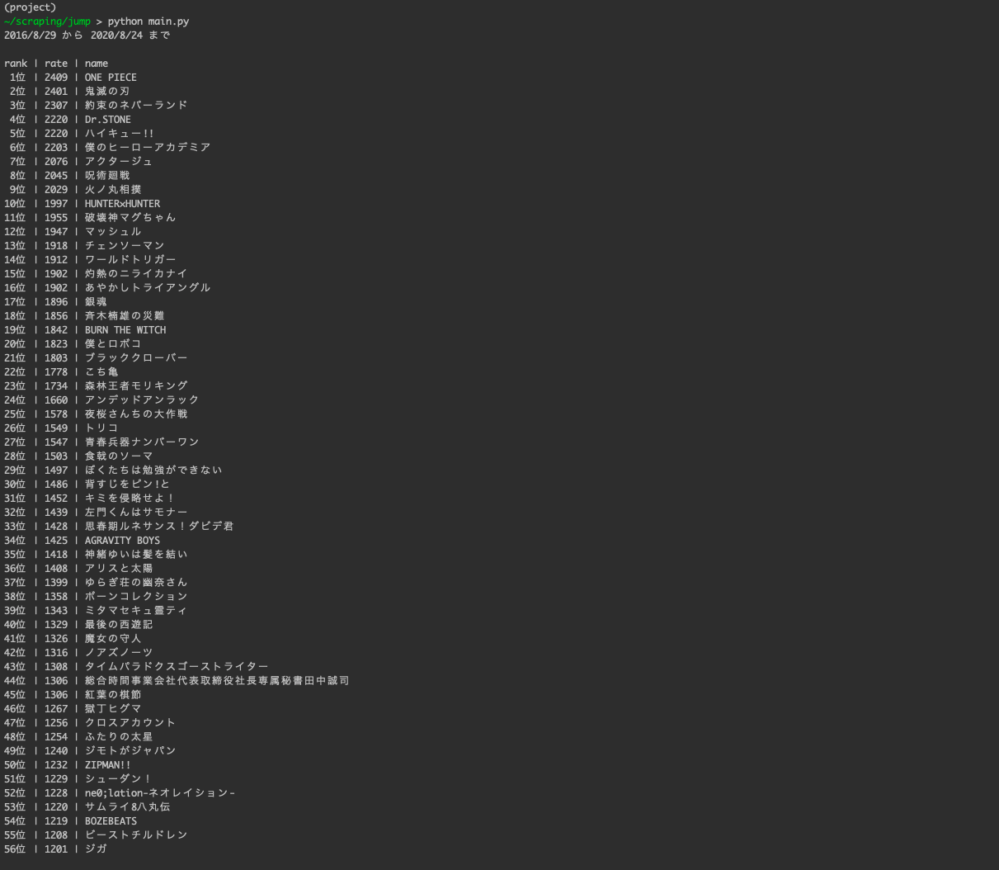

# scraping-rating-jump

- 過去のジャンプの順位をスクレイピングする。([使用したサイト](https://jumpranking.blog.fc2.com/))
- 過去のジャンプの順位を基にイロレーティングを使って作品毎のレートを算出する。
 
## DEMO
 
### 出力結果


 
## Requirement
 
* python==3.6.5
* beautifulsoup4==4.9.1
* certifi==2020.6.20
* chardet==3.0.4
* idna==2.10
* requests==2.24.0
* soupsieve==2.0.1
* urllib3==1.25.10
 
## Installation
 
```bash
pip install -r requirements.txt
```
 
## Usage
 
### スクレイピング
 
```bash
git clone https://github.com/hoge/~
cd examples
mkdir data
python get_data.py
```

main関数内のmax_pageを好きな値に変更することで、取得するデータの数を選べます。

```main.py
def main():

    max_pages = 20　#好きな値に変更
```

実行結果として、dataディレクトリ内に出版日毎に掲載順のファイルが保存される。

### イロレーティング

```bash
python main.py
```

実行結果として、画面内にタイトル毎の順位、レート、名前が出力される。
 
## Note
 
 get_data.pyを使う際は相手のサーバーに負担をかけないようにtime.sleepで通信にある程度時間を置く。
 
